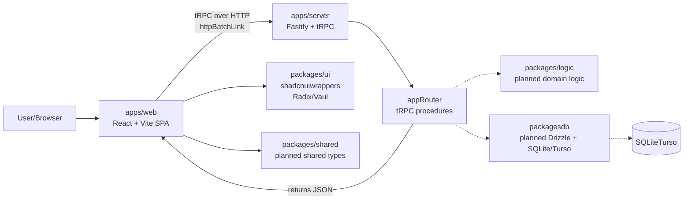

```mermaid
flowchart LR
  U[User/Browser] --> W[apps/web<br/>React + Vite SPA]
  W -->|tRPC over HTTP<br/>httpBatchLink| API[apps/server<br/>Fastify + tRPC]
  API --> R[appRouter<br/>tRPC procedures]
  R -->|returns JSON| W

  W --> UI[packages/ui<br/>shadcnuiwrappers<br/>Radix/Vaul]
  W --> S[packages/shared<br/>planned shared types]
  R -.-> L[packages/logic<br/>planned domain logic]
  R -.-> DBP[packagesdb<br/>planned Drizzle + SQLite/Turso]
  DBP -.-> DB[(SQLiteTurso)]

```